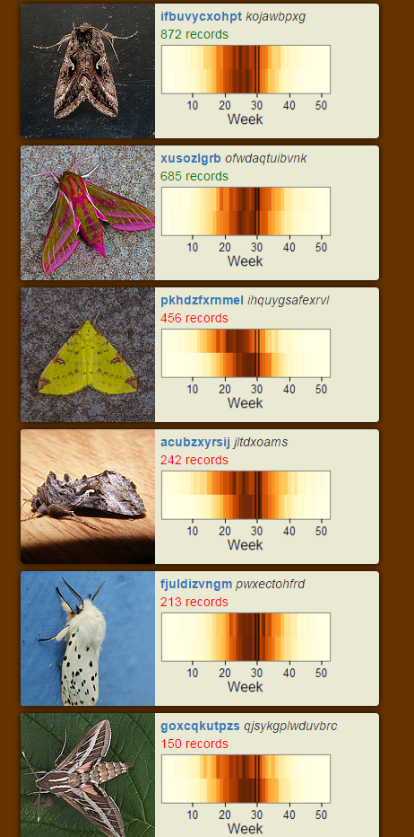

# What's flying tonight?
A web app to provide access to moths species flying at the users location

# Status

Under development

# How to run

In your R console:

```r
install.packages(c('shiny', 'ggplot2', 'RColorBrewer', 'grid'))
library(shiny)
runGitHub('biologicalrecordscentre/whats_flying_tonight')
```

